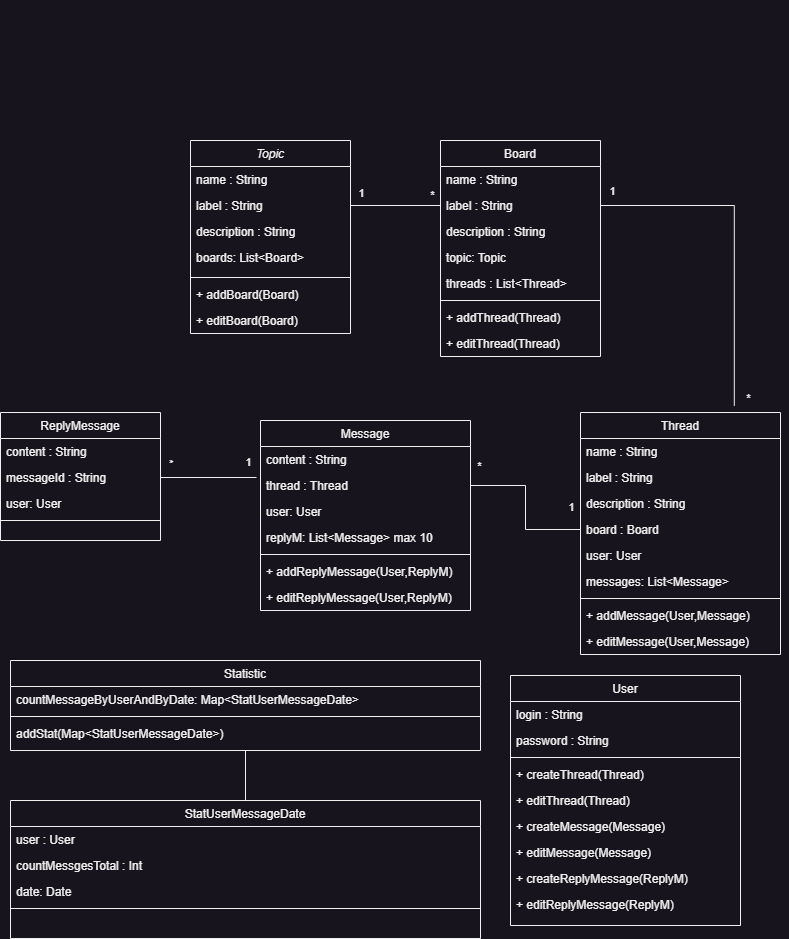
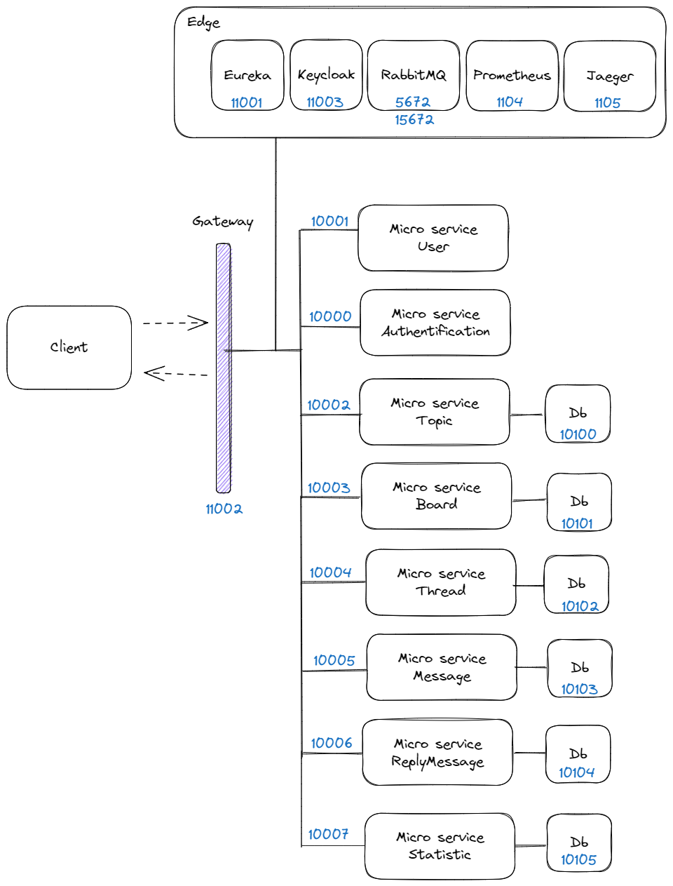
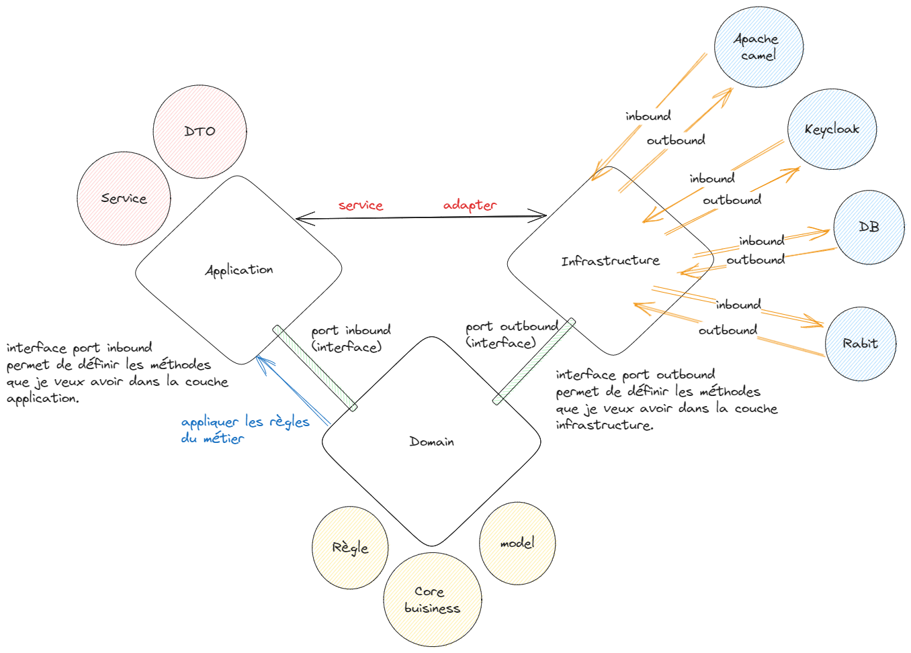

Il s'agit d'un test des techniques.

## Contexte du test

- Création d'une application appelée Redoot, qui est une sorte de clone de Reddit, en backend de type API.
- Contraites :
    - [x] 	Java 11
    - [x] 	Camel
    - [x] 	Junit
- Fonctionnalités attendues :    
    - [x] 	Création de board par topic
    - [x]   Création de thread dans une board
    - [x]   Enregistrement d'un nouvel utilisateur
        - [x]   pseudo
        - [x]   mot de passe
-  Chaque utilisateur peut :
    - [x]   Créer un thread dans une board
    - [x]   Editer ses messages
    - [x]   Consulter d'autres threads et y participer
    - [x]   Répondre à un message sur un thread
    - [x]   Répondre à une réponse (max 10 réponses récursives).
- Realisation d'une statistique
    - [x]   nombre de message par jour et par utilisateur
    - [x]   cette statistique est à stocker en base
 

## Plan du logiciel

A partir de la liste des fonctionnalités attendues, j'ai réalisé une modélisation UML 2 simplifiée :

J'hésitais à inclure la table Topic dans la table Board. Finalement, j'ai décidé de les séparer en deux tables distinctes car cela permet une meilleure visibilité et organisation.

## Choix d'architectures

### Architecture de déploiement

| Nom de l'archi | Avantage | Inconvénient | Adaptée au contexte ? |
|---|---|---|---|
| Monolithique | Déploiement simple initial, moins de complexité, rapidité du développement | Difficile à gérer et à évoluer à mesure que l'application grandit | Oui et non. Ca dépend de l'évolution souhaitée du projet |
| Microservices | Évolutivité et déploiement indépendant des services | Complexité accrue, coordination entre les services, longue durée de développement | Oui et non. Ca dépend de l'évolution souhaitée du projet également |
| Serverless | Évolutivité automatique et gestion simplifiée des ressources | Limitations sur les langages supportés et les temps d'exécution | Non |

Comme je n'ai pas de "contrainte de temps", j'ai préféré utiliser l'**architecture de microservices** pour démontrer mes compétences étendues. Cependant, si j'avais été confronté à une contrainte de temps, j'aurais opté pour l'architecture monolithique

### Architecture de structure du code

| Architecture | Avantage | Inconvénient | Adaptée au contexte ? |
|--------------|----------|--------------|----------------------|
| Hexagonal (Ports and Adapters) | Séparation claire des dépendances, facilité de testabilité | Complexité accrue, nécessite une bonne compréhension des concepts | Oui. Car le système peut encore évolué. |
| Model-View-Controller (MVC) | Séparation claire des préoccupations, facilité de développement web | Complexité accrue pour des applications complexes, dépendances entre les composants | Oui mais il serait risqué d'ajouter des fonctionnalités supplémentaires à l'avenir. Étant donné qu'il s'agit d'un test technique, je préfère utiliser une architecture plus complexe pour démontrer mes compétences. |
| Event-Driven | Découplage des composants, extensibilité | Complexité accrue de la gestion des événements, communication asynchrone | Non, projet ne nécessite pas de communication en temps réel |
| Service-Oriented Architecture (SOA) | Réutilisation des services, flexibilité | Complexité accrue de la gestion des services, communication entre les services | Non, le logiciel est spécifique et ne sera pas utilisé dans d'autres projets |
| Domain-Driven Design (DDD) | Modélisation basée sur le domaine, alignement avec les besoins métier | Complexité accrue de la modélisation, courbe d'apprentissage initiale | Non, le projet est relativement simple. Ce n'est pas nécessaire. |

J'ai donc décidé d'utiliser l'architecture hexagonale car elle est plus intéressante et amusante que l'approche MVC traditionnelle.

J'avais envisagé d'utiliser JHipster, un puissant générateur d'applications basé sur Spring Boot. JHipster regroupe plusieurs frameworks et technologies pour faciliter le développement en proposant une configuration préétablie de Spring Boot avec différentes architectures, dont l'architecture hexagonale.

Cependant, à la fin, j'ai décidé de créer ma propre architecture hexagonale, car cela me semblait être une excellente opportunité pour améliorer mes compétences. Même si cette approche est simplifiée, elle me permet de mieux comprendre et maîtriser les concepts de l'architecture hexagonale

### L'architecture de l'application en micro service

Voici l'architecture globale de l'application basée sur une architecture de microservices :

Et l'architecture hexagonale chaque microservice :

**Couche domain** : Couche centrale de l'architecture hexagonale, contenant les entités ( = models) et les règles métier. Cette couche n'a pas le droit d'avoir des libaries, que du POJO. Et elle est totalement indépendante des 2 autres couches.

Ports Interfaces : Interfaces qui définissent les contrats et les opérations requises par les ports pour interagir avec le domaine. Il existe 2 ports différents : 
- inbound : les ports entrants, qui relient la couche application avec le domaine. Ces ports définissent les méthodes et les opérations internes que la couche application peut utiliser pour interagir avec le domaine
- oubound: les ports sortants, qui représentent les points de connexion de l'application avec les composants externes. Ces ports définissent les opérations nécessaires pour travailler avec des composants externes tels que les bases de données, les services externes, les interfaces utilisateur, etc.

**Couche application** : Couche responsable de la gestion des cas d'utilisation et de l'orchestration des interactions entre les différentes parties du système.

**Adapter** : Composants qui implémentent les interfaces des ports et permettent l'interaction entre le domaine et les composants externes. 

**Couche infrastructure** : Couche responsable de la gestion des composants externes, telle que la base de données, rabbitMQ, Keycloak, etc ...

L'un des principaux avantages de l'architecture hexagonale est la séparation claire des responsabilités. Elle permet de développer le cœur du métier sans se soucier des détails des composants externes. Cela permet de faire avancer le projet sans attendre la décision ou la mise en place des composants externes.

## Garantir la qualité du code
- J'ai appliqué les principes SOLID pour favoriser une conception de code maintenable, extensible et cohérente.
- J'ai écrit des tests unitaires et des tests d'intégration en respectant les principes FIRST pour assurer une couverture de test adéquate.
- J'ai utilisé JaCoCo pour vérifier la couverture du code, en veillant à atteindre un minimum de 95% de couverture de code.
- J'ai généré des rapports JaCoCo séparés pour les tests unitaires, les tests d'intégration et les rapports fusionnés.
- J'ai documenté le code en utilisant la javadoc pour les commentaires des méthodes et les annotations OpenAPI pour décrire les points d'API.
- J'ai utilisé SonarQube pour analyser la qualité du code, en veillant à avoir 0 code smells et moins de 2 % duplications de code.

## Approche de développement
- Pour les tests unitaires et d'intégration, j'ai utilisé la structure Given/When/Then pour définir les étapes du test. Cette approche peut sembler plus simple ou plus "enfantin" par rapport à l'approche Arrange/Act/Assert, mais elle offre une clarté et une lisibilité accrues dans la rédaction des tests. Cependant, si vous préférez l'approche Arrange/Act/Assert (AAA), c'est ok. Enfin, l'objectif est d'assurer la compréhension et la maintenabilité des tests, peu importe l'approche utilisée.
- Le reste, J'ai suivi les pratiques standards utilisées par les développeurs conventionnels pour les autres aspects du développement. Cela comprend l'organisation du code, la nommage des variables et des fonctions, le respect des conventions de codage et d'autres bonnes pratiques communément acceptées dans la communauté de développement. L'objectif était de maintenir une cohérence et une lisibilité du code, afin de faciliter la collaboration et la compréhension pour les développeurs qui travaillent sur le projet.

## Déploiement
Comme demandé, l'application sera déployée à l'aide d'un fichier Docker Compose qui regroupe les conteneurs des microservices, des bases de données et des services périphériques (edge). Ce fichier Docker Compose permettra de gérer et d'orchestrer facilement l'ensemble des conteneurs nécessaires pour le déploiement de l'application.

Dans la dockerisation, j'ai mis le profile demo. Ce profil permet d'insérer des jeux de tests dans la base de données lors du déploiement. Si vous ne le souhaitez pas, il suffit d'enlever le profile du fichier docker-compose.yml :

`- spring.profiles.active=demo`

J'ai également inclus 2 utilisateurs :

`admin:admin`
`user1:test`

Voici la commande pour démarrer l'application :

`docker-compose up -d`

## Les jeux de tests

Il existe de nombreux jeux de tests pour l'application. Pour faciliter leur utilisation, j'ai préféré exporter ma configuration Postman. Voici le fichier contenant ma configuration de tests Postman : [lien vers le fichier](doc/reddot.postman_collection.json). Vous pouvez importer ce fichier dans Postman pour accéder à l'ensemble des jeux de tests prédéfinis.

## Mes remarques 
Le plus grand inconvénient que j'ai identifié dans ce projet est l'absence de DevOps. Je n'ai pas mis en place de processus de DevOps car l'architecture microservices n'est pas adaptée aux dépôts GitHub. Avec cette architecture, chaque microservice devrait avoir son propre dépôt et son propre processus de déploiement. Cela signifierait que je devrais créer sept dépôts distincts dans mon compte personnel, ce qui ne me convient pas vraiment. Pour ce type d'architecture, je pense que le meilleur outil de gestion de dépôt serait **Bitbucket**, car il permet de créer facilement des projets dans le même compte et d'avoir plusieurs "sous-dépôts". Cela permettrait de séparer mes projets personnels du test technique. 

Si Bitbucket avait été mentionné dans les contraintes, j'aurais volontiers mis en place le DevOps. Chaque microservice aurait eu son propre pipeline de qualité intégré, avec des étiquettes provenant de SonarQube et une meilleure gestion de l'historique des versions. Cependant, étant donné que Bitbucket n'a pas été mentionné comme une option, j'ai dû adapter ma démarche en conséquence

Autre remarque : il est possible d'améliorer la gestion des microservices en ajoutant des fonctionnalités telles que des circuit breakers, un Spring Cloud Config, Apache Kafka, etc. Cependant, étant donné que je ne souhaite pas m'éterniser sur le test, j'ai opté pour une approche minimaliste.

De plus, j'ai également remarqué qu'avec Spring Boot 2.11 (j'ai choisi cette version car Spring Boot 3 nécessite au minimum Java 17), il y a pas mal de vulnérabilités découvertes par des chercheurs. Il serait peut-être préférable de migrer vers la version 3 de Spring Boot en modifiant la contrainte du prérequis, cad, passer de java 11 à 17. De plus, la version 17 de Java est considérée comme une version LTS.

Pour résumer, j'ai vraiment apprécié ce test et j'ai pris beaucoup de plaisir à le réaliser. Merci à vous !